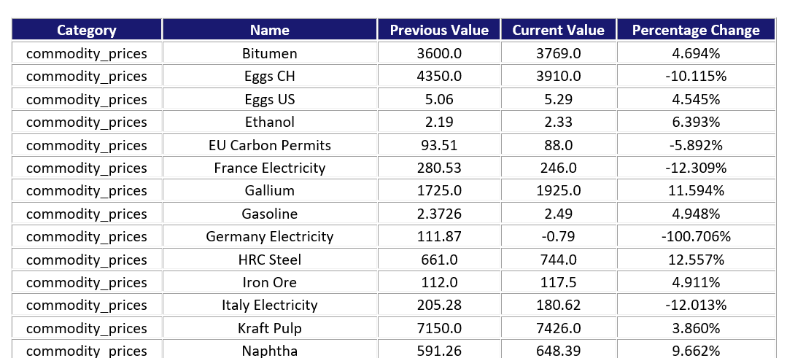

# Economic-Monitor
  This is a Python class that collects data on exchange rates, stock prices, bond yields, market indices, and commodity prices, stores data in MySQL database, and generates daily and weekly reports through email to show the significant changes in economic data.
## Getting Started
### MySQL Database
  This Python class scrapes economic data, and stores it in MySQL database. To utilize the class, make sure MySQL is properly installed. Execute EconomicMonitorSQLScript.sql to prepare the data tables required.
### Initializing the Object
```Python
monitor = EconomicMonitor("localhost", 3306, "root", "123456", "economicmonitor@gmail.com")
# Generate an EconomicMonitor object with the database host being "localhost", port being 3306, user being "root", passwd being "123456", and the email address receiving reports being "economicmonitor@gmail.com"
```
  The arguments passed to initialize the EconomicMonitor object describe the host, port, user, and password of the database "economic_monitor". An email address for receiving the economic reports is also passed in.
## Functions
### Data Collection
```Python
monitor.data_collection()
```
  The data_collection function will scrape exchange rates of major currencies, stock prices in the New York Stock Exchange and NASDAQ Stock Exchange, market indices, bond yields of major countries, and commodity prices.
### Graphing
  This Python class uses Pandas and Matplotlib for data visualization. A function named graph_generator can be used to graph the data.
#### Graphing a manually set watchlist
```Python
monitor.graph_generator()
```
  The call of the graph_generator function without passing arguments will allow users to manually enter a watchlist of different items. After that, the function will graph  and show the changes in value of the items in the watchlist.
#### Generating Graphs of Significant Changes
```Python
name_list = monitor.daily_watchlist_generator()
path = "dailyGraphs"
monitor.graph_generator(watchlist=name_list, path=path)
```
  The function daily_watch_list_generator will look through the database and return a list of all items that have a significant change (by default over 1%) in value compared to that of the day before. The call of graph_generator with arguments will graph all items in the list and saves the graphs in the target directory (dailyGraphs in this case).
 ```Python
name_list = monitor.weekly_watchlist_generator()
path = "weeklyGraphs"
monitor.graph_generator(watchlist=name_list, path=path)
```
The code above graphs all items that have a significant change in the value compared to that of one week ago, and then saves all the graphs in the target directory (weeklyGraphs).


### Sending Reports
#### Generating Daily Reports
```Python
monitor.message_generator(message_type=0)
```
The call of message_generator with the argument message_type=0 will generate a daily report. The report summarizes all items with significant changes in values with the name, current value, previous value, and percentage change of the items. The report will be organized as an HTML table with all graphs of the items attached to an email. The email will be sent to the email address set when initializing the object (economicmonitor@gmail.com in this case).



#### Generating Weekly Reports
```Python
monitor.message_generator(message_type=1)
```
The call of message_generator with the argument message_type=1 will generate a weekly report that summarizes the weekly changes in values of the items. The report will be sent through email to the address set when initializing the object.
### Working Routinely
The Schedule module can be used to set the working routine for the class.
```Python
import schedule
monitor = EconomicMonitor("localhost", 3306, "root", "123456", "economicmonitor@gmail.com")
# Generate an EconomicMonitor object with the database host being "localhost", port being 3306, user being "root", passwd being "123456", and the email address receiving reports being "economicmonitor@gmail.com"


def daily_message_generator():
    monitor.message_generator(message_type=0)


def weekly_message_generator():
    monitor.message_generator(message_type=1)


schedule.every().day.do(monitor.data_collection)
schedule.every().day.do(daily_message_generator)
# Collect data and generate daily report everyday
schedule.every().week.do(weekly_message_generator)
# Generate weekly report every week

while True:
    schedule.run_pending()
    time.sleep(1)
```
The schedule module allows the EconomicMonitor class to collect data every day, generate a daily report every day, and generate a weekly report every week. 

   
